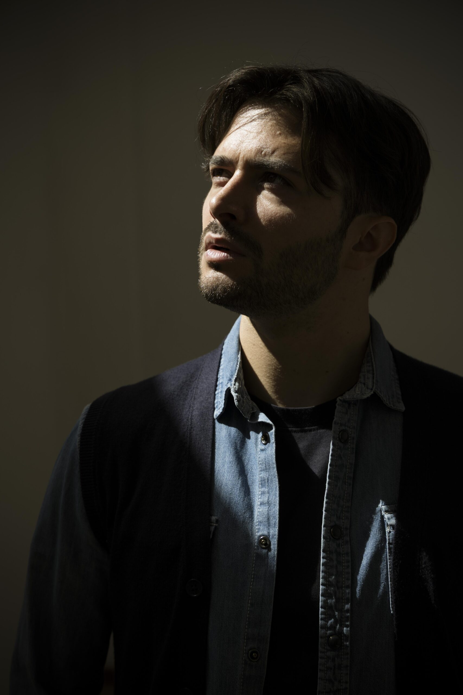

# Portfolio Attore Alessandro Scafati



## Descrizione del Sito

Questo è il portfolio professionale di **Alessandro Scafati**, attore, performer e artista. Il sito presenta un design elegante e moderno con un tema scuro e accenti dorati, che riflette la professionalità e l'arte dell'attore.

## Sezioni Principali

### 🏠 **Homepage**
- **Hero Section**: Presentazione principale con immagini in crossfade e titolo animato
- **About Section**: Sezione composita che include:
  - **Bio**: Biografia e presentazione dell'attore
  - **Events**: Anteprima degli eventi più recenti
  - **Showreel**: Video dimostrativo delle capacità artistiche
  - **More Content**: Contenuti aggiuntivi e approfondimenti

### 📅 **Eventi** (`/eventi`)
- **Calendario interattivo**: Visualizzazione mensile degli eventi
- **Lista eventi**: Dettagli completi di ogni evento con possibilità di filtraggio per data
- **Eventi singoli**: Pagine dedicate per ogni evento specifico

### 📋 **Curriculum** (`/curriculum`)
- **Esperienze professionali**: Panoramica completa del percorso artistico
- **Timeline multi-settore**: Cronologia dettagliata divisa per:
  - 🎭 **Teatro**: Spettacoli e ruoli teatrali
  - 🎬 **Cinema**: Film e produzioni cinematografiche
  - 📺 **Televisione**: Serie TV e programmi televisivi
  - 📢 **Pubblicità**: Campagne pubblicitarie e spot

### 📸 **Book** (`/book`)
- **Gallería fotografica**: Layout a masonry con immagini professionali
- **Portfolio visivo**: Raccolta delle migliori foto scattate per casting e presentazioni
- **Effetti interattivi**: Hover effects e animazioni fluide

### 📰 **Press** (`/press`)
- Articoli e recensioni
- Interviste e media coverage
- Riconoscimenti e premi

### 📞 **Contatti** (`/contatti`)
- Informazioni per casting e collaborazioni
- Contatti diretti e social media
- Modulo di contatto integrato

## Caratteristiche Tecniche

- **Framework**: React con TypeScript
- **Styling**: Tailwind CSS con tema personalizzato
- **Animazioni**: Framer Motion per transizioni fluide
- **Routing**: React Router per navigazione SPA
- **Responsive**: Design completamente responsive per tutti i dispositivi
- **Performance**: Ottimizzato con Vite per build veloci

## Palette Colori

- **Sfondo principale**: Nero (`#000000`)
- **Testo principale**: Bianco/Zinc (`#ffffff`, `#f4f4f5`)
- **Accenti**: Oro (`#d1af89`)
- **Elementi UI**: Gradazioni di grigio e oro per contrasto elegante

## Font

- **Titoli**: Dancing Script (elegante e artistico)
- **Testo**: Lato (moderno e leggibile)

---

*Sito sviluppato per presentare il portfolio professionale di Alessandro Scafati nel mondo dello spettacolo italiano.*

## Installazione e Avvio

```bash
# Installa le dipendenze
npm install

# Avvia il server di sviluppo
npm run dev

# Build per produzione
npm run build
```

## Tecnologie Utilizzate

- **React 18** con TypeScript
- **Vite** per il build system
- **Tailwind CSS** per lo styling
- **Framer Motion** per le animazioni
- **React Router** per la navigazione
- **Lucide React** per le icone
